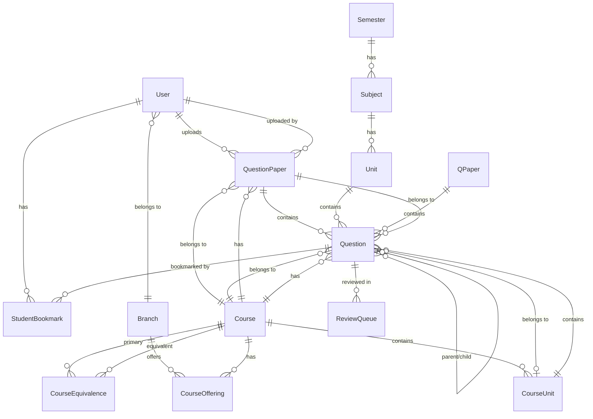

# Entity-Relationship Model for QPseg Project

## Overview
This document describes the Entity-Relationship (ER) model for the QPseg (Question Paper Segmentation) project, which is a system for managing, processing, and organizing question papers with AI-powered classification.

## Main Schema (Current Implementation)

### Entity Definitions

#### 1. **User** (users)
- **Primary Key**: `user_id` (Integer)
- **Attributes**:
  - `username` (String, Unique, Not Null)
  - `email` (String, Unique, Not Null)
  - `password_hash` (String, Not Null)
  - `role` (String, Not Null) - Values: ADMIN, STUDENT
  - `branch_id` (Integer, Foreign Key → Branch)
  - `academic_year` (Integer, Nullable) - Values: 1, 2, 3, 4
  - `is_active` (Boolean, Default: True)
  - `created_at` (DateTime)
  - `updated_at` (DateTime)
- **Relationships**:
  - Many-to-One with **Branch** (users belong to a branch)
  - One-to-Many with **QuestionPaper** (users upload papers)
  - One-to-Many with **StudentBookmark** (students bookmark questions)

#### 2. **Branch** (branches)
- **Primary Key**: `branch_id` (Integer)
- **Attributes**:
  - `branch_name` (String, Unique, Not Null)
  - `branch_code` (String, Unique, Not Null)
  - `description` (String, Nullable)
  - `is_active` (Boolean, Default: True)
  - `created_at` (DateTime)
  - `updated_at` (DateTime)
- **Relationships**:
  - One-to-Many with **User** (branch has many users)
  - One-to-Many with **CourseOffering** (branch offers courses)

#### 3. **Course** (courses)
- **Primary Key**: `course_code` (String)
- **Attributes**:
  - `course_name` (String, Not Null)
  - `credits` (Integer, Not Null)
  - `course_type` (String, Not Null) - Values: CORE, ELECTIVE, LAB
  - `description` (Text, Nullable)
  - `is_active` (Boolean, Default: True)
  - `created_at` (DateTime)
  - `updated_at` (DateTime)
- **Relationships**:
  - One-to-Many with **CourseOffering** (course has multiple offerings)
  - One-to-Many with **CourseUnit** (course has units)
  - One-to-Many with **CourseEquivalence** (as primary course)
  - One-to-Many with **CourseEquivalence** (as equivalent course)
  - One-to-Many with **QuestionPaper** (course has question papers)
  - One-to-Many with **Question** (course has questions)

#### 4. **CourseOffering** (course_offerings)
- **Primary Key**: `offering_id` (Integer)
- **Attributes**:
  - `course_code` (String, Foreign Key → Course, Not Null)
  - `branch_id` (Integer, Foreign Key → Branch, Not Null)
  - `academic_year` (Integer, Not Null) - Values: 1, 2, 3, 4
  - `semester_type` (String, Not Null) - Values: ODD, EVEN
  - `is_active` (Boolean, Default: True)
  - `created_at` (DateTime)
- **Relationships**:
  - Many-to-One with **Course** (offering belongs to a course)
  - Many-to-One with **Branch** (offering belongs to a branch)

#### 5. **CourseEquivalence** (course_equivalence)
- **Primary Key**: `equivalence_id` (Integer)
- **Attributes**:
  - `primary_course_code` (String, Foreign Key → Course, Not Null)
  - `equivalent_course_code` (String, Foreign Key → Course, Not Null)
  - `reason` (String, Nullable)
  - `is_active` (Boolean, Default: True)
  - `created_at` (DateTime)
- **Relationships**:
  - Many-to-One with **Course** (as primary course)
  - Many-to-One with **Course** (as equivalent course)

#### 6. **CourseUnit** (course_units)
- **Primary Key**: `unit_id` (Integer)
- **Attributes**:
  - `course_code` (String, Foreign Key → Course, Not Null)
  - `unit_number` (Integer, Not Null)
  - `unit_name` (String, Not Null)
  - `topics` (Text, Nullable) - JSON string of topics
  - `is_active` (Boolean, Default: True)
  - `created_at` (DateTime)
  - `updated_at` (DateTime)
- **Relationships**:
  - Many-to-One with **Course** (unit belongs to a course)
  - One-to-Many with **Question** (unit has questions)

#### 7. **QuestionPaper** (question_papers)
- **Primary Key**: `paper_id` (Integer)
- **Attributes**:
  - `course_code` (String, Foreign Key → Course, Not Null)
  - `academic_year` (Integer, Not Null) - Values: 1, 2, 3, 4
  - `semester_type` (Enum, Not Null) - Values: ODD, EVEN
  - `exam_type` (Enum, Not Null) - Values: CIE_1, CIE_2, IMPROVEMENT_CIE, SEE
  - `exam_date` (DateTime, Nullable)
  - `pdf_path` (String, Nullable) - Permanent storage path
  - `temp_pdf_path` (String, Nullable) - Temporary upload path
  - `uploaded_by` (Integer, Foreign Key → User, Not Null)
  - `processing_status` (Enum, Default: UPLOADED) - Values: UPLOADED, METADATA_PENDING, PROCESSING, COMPLETED, FAILED
  - `processing_progress` (Float, Default: 0.0) - 0-100%
  - `ocr_confidence` (Float, Nullable)
  - `total_questions_extracted` (Integer, Default: 0)
  - `questions_in_review` (Integer, Default: 0)
  - `file_size` (Integer, Nullable) - in bytes
  - `page_count` (Integer, Nullable)
  - `created_at` (DateTime)
  - `updated_at` (DateTime)
- **Relationships**:
  - Many-to-One with **Course** (paper belongs to a course)
  - Many-to-One with **User** (paper uploaded by a user)
  - One-to-Many with **Question** (paper contains questions)

#### 8. **Question** (questions)
- **Primary Key**: `question_id` (Integer)
- **Attributes**:
  - `paper_id` (Integer, Foreign Key → QuestionPaper, Not Null)
  - `course_code` (String, Foreign Key → Course, Not Null)
  - `unit_id` (Integer, Foreign Key → CourseUnit, Nullable)
  - `question_number` (String, Not Null) - e.g., "1", "2a", "3(ii)", "Q5"
  - `question_text` (Text, Not Null)
  - `marks` (Integer, Nullable)
  - `bloom_level` (Enum, Nullable) - Values: REMEMBER(1), UNDERSTAND(2), APPLY(3), ANALYZE(4), EVALUATE(5), CREATE(6)
  - `bloom_category` (Enum, Nullable) - Values: Remembering, Understanding, Applying, Analyzing, Evaluating, Creating
  - `bloom_confidence` (Float, Nullable)
  - `difficulty_level` (Enum, Nullable) - Values: Easy, Medium, Hard
  - `classification_confidence` (Float, Nullable)
  - `is_canonical` (Boolean, Default: True)
  - `parent_question_id` (Integer, Foreign Key → Question, Nullable) - For sub-questions
  - `similarity_score` (Float, Nullable)
  - `has_subparts` (Boolean, Default: False)
  - `has_mathematical_notation` (Boolean, Default: False)
  - `image_path` (String, Nullable) - Cropped question image
  - `page_number` (Integer, Nullable)
  - `created_at` (DateTime)
  - `updated_at` (DateTime)
- **Relationships**:
  - Many-to-One with **QuestionPaper** (question belongs to a paper)
  - Many-to-One with **Course** (question belongs to a course)
  - Many-to-One with **CourseUnit** (question belongs to a unit)
  - Self-referential (parent-child relationship for sub-questions)
  - One-to-Many with **StudentBookmark** (question can be bookmarked)
  - One-to-Many with **ReviewQueue** (question can have review entries)

#### 9. **ReviewQueue** (review_queue)
- **Primary Key**: `review_id` (Integer)
- **Attributes**:
  - `question_id` (Integer, Foreign Key → Question, Not Null)
  - `issue_type` (String, Not Null) - Values: LOW_CONFIDENCE, AMBIGUOUS_UNIT, OCR_ERROR
  - `suggested_correction` (Text, Nullable) - JSON string
  - `status` (String, Default: "PENDING") - Values: PENDING, APPROVED, CORRECTED
  - `priority` (Integer, Default: 2) - 1-3 (1=high, 3=low)
  - `created_at` (DateTime)
  - `updated_at` (DateTime)
- **Relationships**:
  - Many-to-One with **Question** (review entry belongs to a question)

#### 10. **StudentBookmark** (student_bookmarks)
- **Primary Key**: `bookmark_id` (Integer)
- **Attributes**:
  - `student_id` (Integer, Foreign Key → User, Not Null)
  - `question_id` (Integer, Foreign Key → Question, Not Null)
  - `notes` (Text, Nullable)
  - `bookmarked_at` (DateTime)
- **Relationships**:
  - Many-to-One with **User** (bookmark belongs to a student)
  - Many-to-One with **Question** (bookmark references a question)

---

## Proposed Schema (From Original Proposal)

This schema represents the original proposed structure, which is simpler and more hierarchical.

#### 1. **Semester** (semesters)
- **Primary Key**: `sem_id` (Integer)
- **Attributes**:
  - `sem_name` (String, Unique, Not Null)
  - `created_at` (DateTime)
  - `updated_at` (DateTime)
- **Relationships**:
  - One-to-Many with **Subject** (semester has subjects)

#### 2. **Subject** (subjects)
- **Primary Key**: `sub_id` (Integer)
- **Attributes**:
  - `sub_name` (String, Not Null)
  - `sem_id` (Integer, Foreign Key → Semester, Not Null)
  - `created_at` (DateTime)
  - `updated_at` (DateTime)
- **Relationships**:
  - Many-to-One with **Semester** (subject belongs to a semester)
  - One-to-Many with **Unit** (subject has units)

#### 3. **Unit** (units)
- **Primary Key**: `unit_id` (Integer)
- **Attributes**:
  - `unit_name` (String, Not Null)
  - `sub_id` (Integer, Foreign Key → Subject, Not Null)
  - `created_at` (DateTime)
  - `updated_at` (DateTime)
- **Relationships**:
  - Many-to-One with **Subject** (unit belongs to a subject)
  - One-to-Many with **Question** (unit has questions)

#### 4. **QPaper** (qpapers)
- **Primary Key**: `paper_id` (Integer)
- **Attributes**:
  - `paper_name` (String, Not Null)
  - `upload_date` (DateTime, Not Null)
  - `file_link` (String, Nullable) - Link to Drive/GitHub
  - `file_path` (String, Nullable) - Local storage path
  - `processing_status` (String, Default: "UPLOADED")
  - `created_at` (DateTime)
  - `updated_at` (DateTime)
- **Relationships**:
  - One-to-Many with **Question** (paper contains questions)

#### 5. **Question** (proposed_questions)
- **Primary Key**: `ques_id` (Integer)
- **Attributes**:
  - `ques_text` (Text, Not Null)
  - `unit_id` (Integer, Foreign Key → Unit, Nullable)
  - `paper_id` (Integer, Foreign Key → QPaper, Not Null)
  - `ai_tag` (String, Nullable) - AI-generated classification tag
  - `confidence_score` (Float, Nullable) - AI classification confidence
  - `created_at` (DateTime)
  - `updated_at` (DateTime)
- **Relationships**:
  - Many-to-One with **Unit** (question belongs to a unit)
  - Many-to-One with **QPaper** (question belongs to a paper)

---

## ER Diagram (Mermaid)

---

## Relationship Summary

### Main Schema Relationships

1. **User ↔ Branch**: Many-to-One (Users belong to a branch)
2. **User ↔ QuestionPaper**: One-to-Many (Users upload papers)
3. **User ↔ StudentBookmark**: One-to-Many (Students bookmark questions)
4. **Branch ↔ CourseOffering**: One-to-Many (Branches offer courses)
5. **Course ↔ CourseOffering**: One-to-Many (Courses have offerings)
6. **Course ↔ CourseUnit**: One-to-Many (Courses have units)
7. **Course ↔ CourseEquivalence**: One-to-Many (Courses can be equivalent)
8. **Course ↔ QuestionPaper**: One-to-Many (Courses have papers)
9. **Course ↔ Question**: One-to-Many (Courses have questions)
10. **CourseUnit ↔ Question**: One-to-Many (Units contain questions)
11. **QuestionPaper ↔ Question**: One-to-Many (Papers contain questions)
12. **Question ↔ StudentBookmark**: One-to-Many (Questions can be bookmarked)
13. **Question ↔ ReviewQueue**: One-to-Many (Questions can be reviewed)
14. **Question ↔ Question**: Self-referential (Parent-child for sub-questions)

### Proposed Schema Relationships

1. **Semester ↔ Subject**: One-to-Many
2. **Subject ↔ Unit**: One-to-Many
3. **Unit ↔ Question**: One-to-Many
4. **QPaper ↔ Question**: One-to-Many

---

## Key Design Decisions

1. **User Management**: Role-based access control (ADMIN/STUDENT) with branch association
2. **Course Structure**: Hierarchical structure with courses, units, and offerings
3. **Question Classification**: AI-powered classification with Bloom's taxonomy and difficulty levels
4. **Review System**: Queue-based review system for quality assurance
5. **Bookmarking**: Students can bookmark questions for later review
6. **Processing Pipeline**: Status tracking for question paper processing (OCR, extraction, classification)
7. **Self-Referential Questions**: Support for parent-child relationships for sub-questions

---

## Notes

- The main schema is the current implementation used in the application
- The proposed schema represents the original design from the proposal
- Both schemas can coexist in the database (different table names)
- The main schema is more feature-rich with additional metadata and relationships

